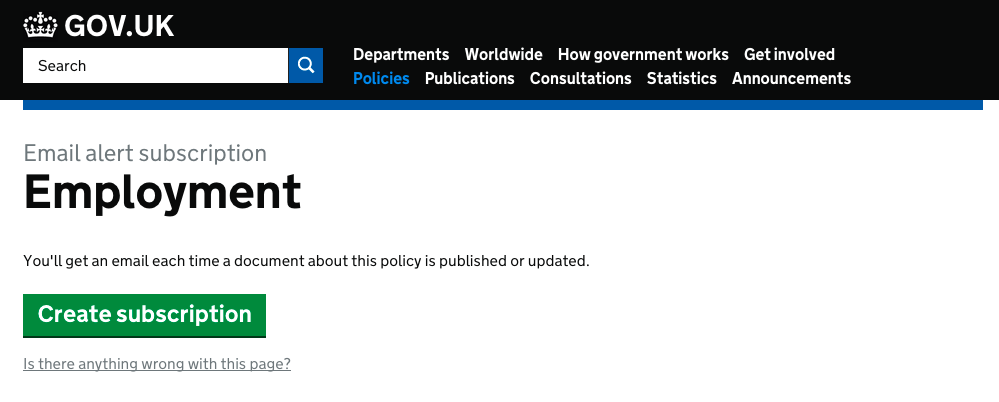

# Email alert frontend

## Purpose



A consistent frontend for displaying email alert signup pages.

## Live examples

- [gov.uk/government/policies/academies-and-free-schools/email-signup](https://www.gov.uk/government/policies/academies-and-free-schools/email-signup)

## Nomenclature

- Email Alert Signup: a page displaying the title of what the User is signing up to
- Tags: A key and array value pair which when are used by the [Email Alert API](https://github.com/alphagov/email-alert-api) to forward the user onto the govdelivery signup URL

## Dependences

- [alphagov/email-alert-api](https://github.com/alphagov/email-alert-api)
- [alphagov/content-store](https://github.com/alphagov/content-store)
- [alphagov/static](https://github.com/alphagov/static)

## Running the application

```
  $ ./startup.sh
```

If you are using the GDS development virtual machine then the application will be available on the host at http://email-alert-frontend.dev.gov.uk/

## Running the test suite

```
$ bundle exec rake
```

## Content Item

The [schema](https://github.com/alphagov/govuk-content-schemas/tree/master/formats/email_alert_signup) sets out the fields required for the Content Item. The only two fields required in the details hash are `summary` and `tags`:

```
"summary": "You'll get an email each time any information on this policy is published or updated.",
"tags": {
  "policy": [
    "employment"
  ]
}
```

Your email alert signup page can then be visited at `http://email-alert-frontend.dev.gov.uk/#{base_path}`
